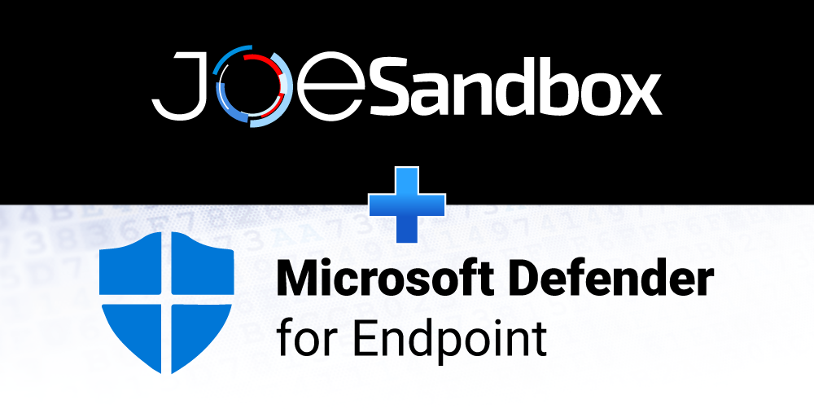
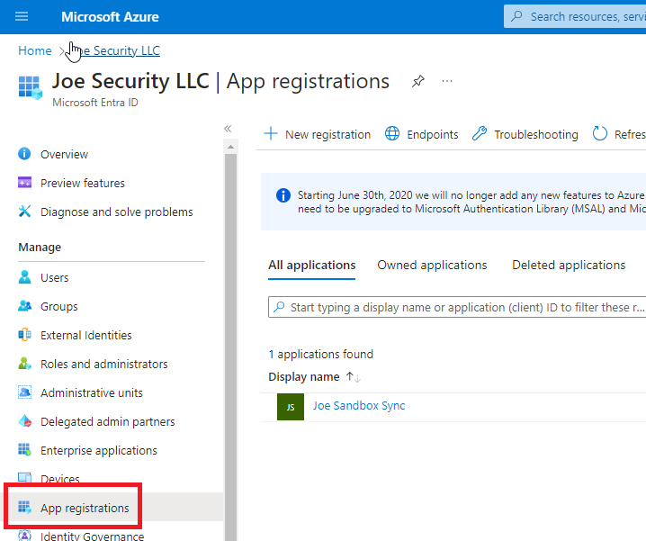
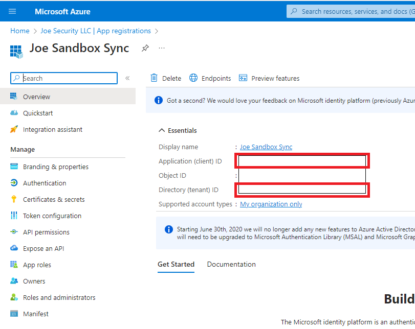
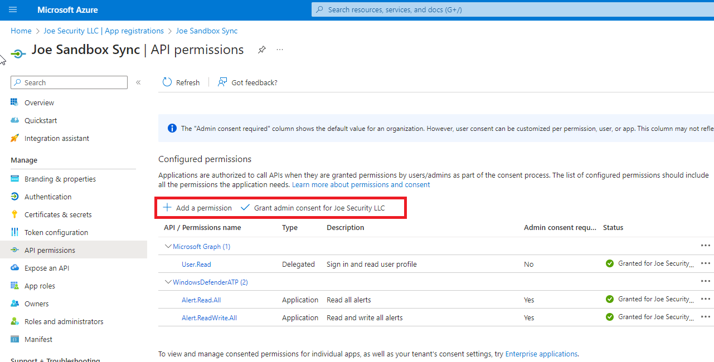
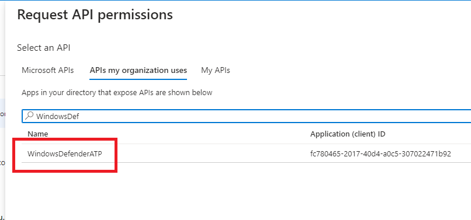
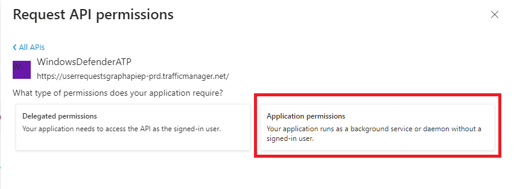
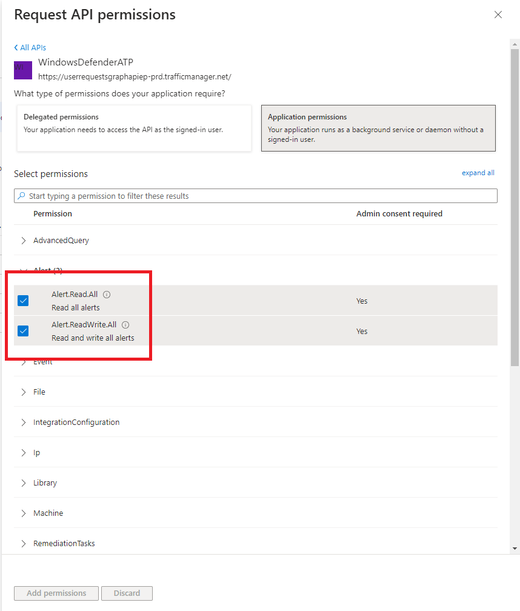
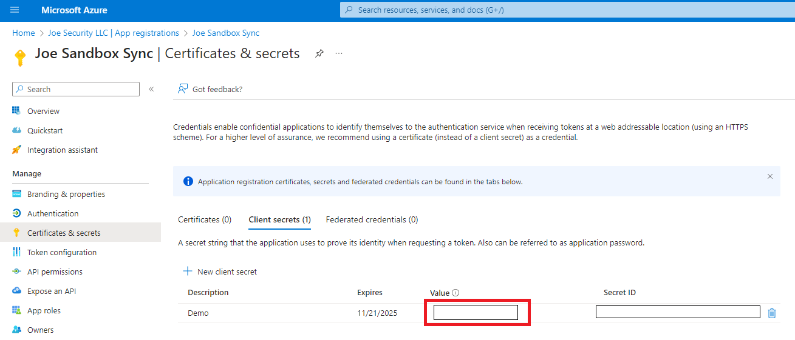

# Joe-Sandbox-Microsoft-Defender-Addon
This script will enrich your Microsoft Defender Alerts with Joe Sandbox analysis data (Score, Detection, Threatname and link to the analysis).

## Requirements
- Python 3.x with required packages ([Required Packages](requirements.txt))
- Microsoft Defender for Endpoint
- Joe Sandbox Cloud Pro or Basic API key

## Installation & Setup

Clone the repository into your folder.

    git clone https://github.com/joesecurity/Joe-Sandbox-Microsoft-Defender-Addon.git

Install the requirements.

    pip install -r requirements.txt

## Joe Sandbox Setup

Generate an API Key in `User Settings` - `API key` and copy it to `jbxAPIKey` in [connectory.py](connector.py)

## Microsoft Defender for Endpoint Setup

### Creating Application for API Access

- Open [https://portal.azure.com/](https://portal.azure.com) and `Microsoft Entra ID` service
- Click `App registrations`

- Click `New registration button`, enter the name `Joe Sandbox Sync` and click `register`
- Copy the `Applicatin (client) ID` and `Directory (tenant) ID` to `msClientId` and `msTenantId` in [connectory.py](connector.py)

- Now we need to grant permissions to the App. Click on `API permissions` then `Add a permission`

- Choose `APIs my organization uses` and then type `WindowsDefenderATP`

- Select `Applicaiton Permission`

- Add `Alert.Read.All`, `Alert.ReadWrite.All` and click `Add permission`

- Goto `Certificates and secrets`
- Click `New client secret`
- Copy `Value` to `msAppSecret` in  [connectory.py](connector.py)

- Finally goto `API Permissions` again and click `Grant admin consens` for all permissions

